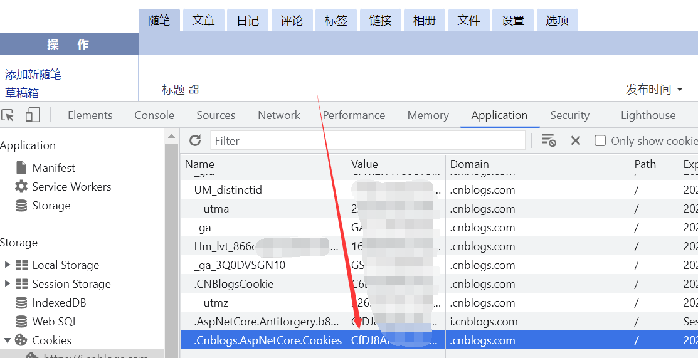
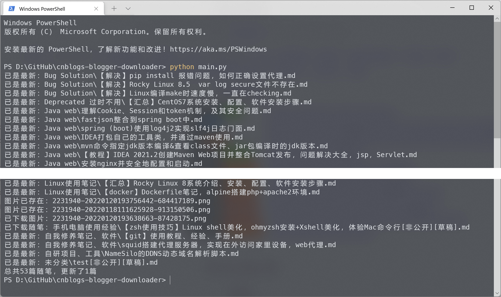

<h1 align="center">
  <a href="#">
  
  </a>
  <br>
</h1>

<p align="center">
<a target="_blank" href="https://www.gnu.org/licenses/gpl-3.0.zh-cn.html"></a>  
<a href="#python3"></a>
<a href="https://www.python-httpx.org/"></a>
</p>
本程序代码开源，流程透明。旨在让博客园作者们安全快捷地拿回属于自己的数据

程序会以博客园的随笔分类来建立文件夹并下载相应的随笔原稿件，文章格式为md格式，同时支持离线文章中引用的图片

右上角点个star⭐不迷路~~~


## Table of Contents

- [Usage](#usage)
    - [Configuration](#configuration)
    - [Dependencies](#dependencies)
    - [Start](#start)
    - [Features](#features)
- [For Developer](#for-developer)
    - [Document](#document)

- [Links](#links)

## Usage

### Configuration

运行前需要配置`config.ini`：

1. 修改`config.ini.example`文件名为`config.ini`，使用文本编辑器打开
2. 打开浏览器登录博客园后台，登录时勾选"记住我"
3. 登录后浏览器按F12，找到Cookie，拷贝`.Cnblogs.AspNetCore.Cookies`的值到`config.ini`中


4. 其余选项按需填写，文件需以UTF-8编码保存

开启离线后，随笔中的图片链接会被替换自动为本地图片的链接


### Dependencies

运行`pip install`前需关闭系统全局代理

```
pip install httpx
```


### Start

配置好程序并安装好httpx依赖后，命令行运行：

```python
python main.py
```

会看到打印的输出:



平时科学上网的话运行时需关闭全局代理，否则http连接错误


### Features

下载的文件名为随笔标题，分类和标题中的特殊字符`\/:*?"<>|`会被空格代替，文件编码为UTF-8

程序会区分你的随笔是否是公开的，是否是草稿状态，并在文件名后追加`[非公开]`或`[草稿]`

程序只能在Windows下运行，未做其他系统适配

如果你在博客园中删除了一篇文章，程序不会删除相应的本地文章

`.CnblogsDownloaderFlag.json`中保存着上次运行程序的时间，如果博客园中的文章未更新，那么不会反复下载

一旦程序决定要下载某篇随笔，那么它会覆盖此随笔及其引用的图片

代码块中的图片也会被下载，只要它的链接是有效的，比如你的随笔中有下列内容

````markdown
假如这是你的随笔原稿
```

```
那么上面代码块里的图片也会被下载
````


## For Developer

博客园公开的api文档：https://api.cnblogs.com/help

但显然不够用，而且要申请api权限，于是自己根据网络通信总结了几个重要的api的文档：[cnblogs-apiDoc](/lib/cnblogs-apiDoc.md)


**项目目录结构**

```
.

├── docs                                   项目API文档，GitHub Pages
├── img                                    readme文档图片	
├── lib                      
│    ├── cnblogs-apiDoc.md                     博客园接口文档
│    └── cnblogs_api.py                        博客园http接口库
├── sphinx                                 构建项目API文档
│     ├── source
│     │     ├── _static
│     │     ├── _templates
│     │     ├── lib
│     │     ├── cnblogs_downloader.rst
│     │     ├── conf.py                            sphinx配置文件
│     │     ├── favicon.ico
│     │     ├── index.rst
│     │     └── main.rst
│     ├── Makefile
│     └── make.bat
├── LICENSE                                项目开源许可证
├── cnblogs_downloader.py                  程序主要逻辑实现
├── config.ini.example                     配置文件示例
├── main.py                                程序入口
└── readme.md                              自述文件
```


### Document

本项目API文档：[**Document**](https://charles94jp.github.io/cnblogs-blogger-downloader)

根据代码文档注释构建API文档：

```
pip install sphinx sphinx-rtd-theme
sphinx-build.exe -b html .\sphinx\source\ docs
```

注意`docs/lib/cnblogs-apiDoc.html` `typora.css`和`docs/.nojekyll`是手动添加进去的


## Links

其他能帮助拿回博客园数据的方法：

- 博客园官方[备份功能](https://www.cnblogs.com/super925/p/8093453.html)：缺点是下载的文件是一个xml，不易于阅读及分离文章
- [InfoSpider](https://github.com/kangvcar/InfoSpider) ，缺点是它下载的是一个json文件，亦不能直接食用


<br></br>

本项目的开源协议为：[GPL-3.0 License](/LICENSE)